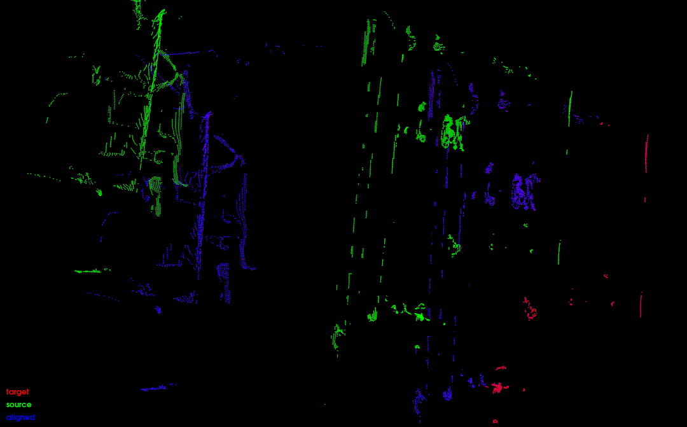
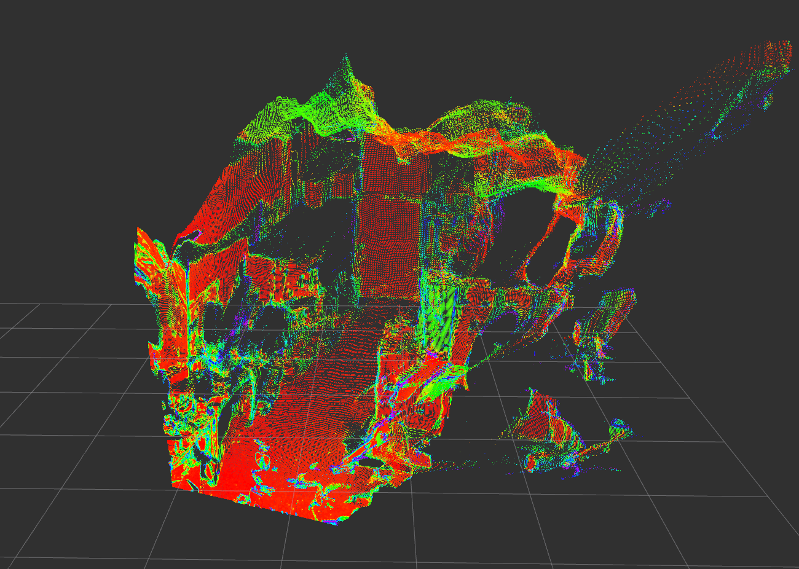

<!-- # Iterative_Closest_Point_-ICP-_width_kd-tree -->
# Iterative Closest Point (ICP) with kd-tree {#iterative_closest_point_icp_with_kd_tree}

<!-- what is this error Iterative_Closest_Point_-ICP-width_kd-tree {#iterative_closest_point-icp-_width_kd-tree data-source-line="1"} -->


Iterative Closest Point (ICP) algorithm for point cloud registration using a kd-tree for fast nearest neighbor search. A scan match example can be seen below;



Scan match above has been created ICP with the addition of a kd-tree for fast nearest neighbor search. Aligned and target is almost on top of each other after the scan match.

The ICP algorithm is modified to use a kd-tree for fast nearest neighbor search. while the ndt_omp is primarily used for testing and comparing other solutions. Significant credit goes to the original authors of the repositories.

The apps/ folder contains test scripts. The original ideas was that the repository should be provided as a ROS2 package, but this was not fully due to other work tasks regarding further implementation of this project.


## Primary changes
- ICP algorithm is modified to use a kd-tree for fast nearest neighbor search.
- Most test scrips are rewritten to supper confidence threshold based on [Confidence mapper to point cloud](https://github.com/ThorKampOpstrup/pseudo_LiDAR_from_pc_pkg), Example below:



## Structure
- include/ : Contains header files.
- apps/ : Contains source code for tests.
- data/ : Contains point clouds for testing.
- src/ : Contains source code.
- CMakeLists.txt : CMake file for building the project.
- package.xml : ROS2 package file.
- README.md : This file


## Install and run
```bash
cd ros2_ws/src
git clone
cd ..
colcon build
source install/setup.bash
ros2 run scan_matcher <desired test and parameters>
# Example
ros2 run scan_matcher icp_from_pc src/li_slam_ros2_with_fpga/Thirdparty/ndt_omp_ros2/data/pseudo_LiDAR_move/6.pcd 50
```

## Future work
- Implement ICP as a ROS2 package calling a service to get the nearest neighbor search from a FPGA. [FPGA nn searcher](https://github.com/ThorKampOpstrup/kdtree_NN_search_FPGA_HLS_KRS)

## Acknowledgement
This github build of the following two repositories:
1. [ndt_omp](https://github.com/koide3/ndt_omp)
2. [ICP-mini-project](https://github.com/zjudmd1015/icp)

# Used Libraries
- Eigen
- PCL
- [ndt_omp](https://github.com/koide3/ndt_omp) (BSD2)
- [ICP-mini-project](https://github.com/zjudmd1015/icp)